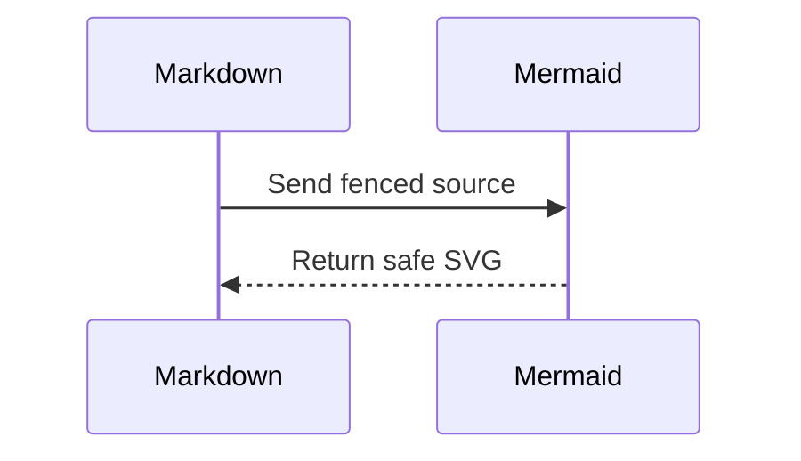

# Markdown Mermaid

The Markdown viewer renders fenced Mermaid blocks in the document surface.

```mermaid
sequenceDiagram
  participant Markdown
  participant Mermaid
  Markdown->>Mermaid: Send fenced source
  Mermaid-->>Markdown: Return safe SVG
```

The source stays available under the rendered diagram.
